# Git commit messages

Nicht jeder Commit erfordert sowohl eine Betreffzeile als auch ein Body. Manchmal reicht eine einzelne Zeile aus, besonders wenn die Änderung so einfach ist, dass kein weiterer Kontext notwendig ist.

Zum Beispiel:

> Ensure a valid first stage bootloader binary
>
> Make sure that the assembler generates a first stage bootloader binarywith correct offsets for the BIOS Parameter Block independent of theNASM version.

Soweit möglich sollte die Betreffzeile auf maximal 50 Zeichen beschränkt werden. 50 Zeichen ist keine harte Grenze, sondern nur eine Faustregel. Wenn die Betreffzeilen so kurzgehalten werden, ist die Lesbarkeit gewährleistet, und der Autor ist gezwungen, einen Moment darüber nachzudenken, wie er am prägnantesten erklären kann was vor sich geht. Das UI von GitHub ist sich dieser Konventionen bewusst und warnt einen, wenn man die Grenze von 50 Zeichen überschreiten. Jede Betreffzeile die länger als 72 Zeichen ist wird vom GitHub UI abgeschnitten. Man sollte 72 Zeichen daher als die harte Grenze betrachten.

Alle Betreffzeilen sollen mit einem Großbuchstaben beginnen.

Commit Messages sind englisch

In der Betreffzeile wird der Imperativ verwendet.

Zum Beispiel:

- Refactor subsystem X for readability
- Update getting started documentation
- Remove deprecated methods
- Release version 1.0.0

Eine richtig geformte Git-Commit-Betreffzeile sollte immer in der Lage sein, den folgenden Satz zu vervollständigen:

If applied, this commit will ...

Zum Beispiel:

- If applied, this commit will refactor subsystem X for readability
- If applied, this commit will update getting started documentation
- If applied, this commit will remove deprecated methods
- If applied, this commit will release version 1.0.0
- If applied, this commit will merge pull request #123 from user/branch

Die Verwendung des Imperativs ist nur in der Betreffzeile wichtig. Diese Einschränkung kann im Body gelockert werden.

Den Body mit 72 Zeichen umbrechen.

Der Body wird verwendet, um zu erklären was, warum und wie.

Man kann im Body auch Aufzählungspunkte verwenden. Vor diese wird ein "-" Geschrieben, dass mit einem Abstand eingerückt ist. Vor und nach einem Aufzählungspunkt soll eine Zeile frei gelassen werden. Eine beispielhafte commit message mit Aufzählungspunkten:

> Merge tag 'nfs-for-5.9-2' of git://git.linux-nfs.org/projects/trondmy/linux-nfs
>
> Pull NFS client bugfixes from Trond Myklebust:
>
> \- Fix an NFS/RDMA resource leak
>
> \- Fix the error handling during delegation recall
>
> \- NFSv4.0 needs to return the delegation on a zero-stateid SETATTR
>
> \- Stop printk reading past end of string
>
> \* tag 'nfs-for-5.9-2' of git://git.linux-nfs.org/projects/trondmy/linux-nfs:SUNRPC: stop printk reading past end of stringNFS: Zero-stateid SETATTR should first return delegationNFSv4.1 handle ERR_DELAY error reclaiming locking state on delegation recallxprtrdma: Release in-flight MRs on disconnect

# Sprint Planning

Für jeden Sprint wird ein eigenes Project Board auf GitHub verwendet. Ein Project Board kann man mit Projects --> New project erstellen.

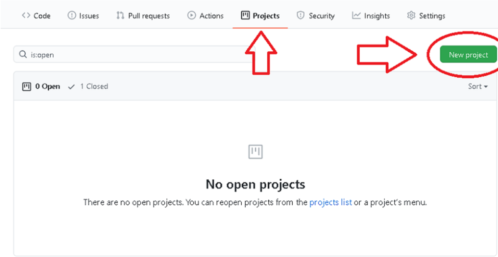

Einem Project Board gibt man einen Namen, und optional eine Beschreibung. Als Projekt Vorlage ist "Automated kanban with reviews" zu wählen.

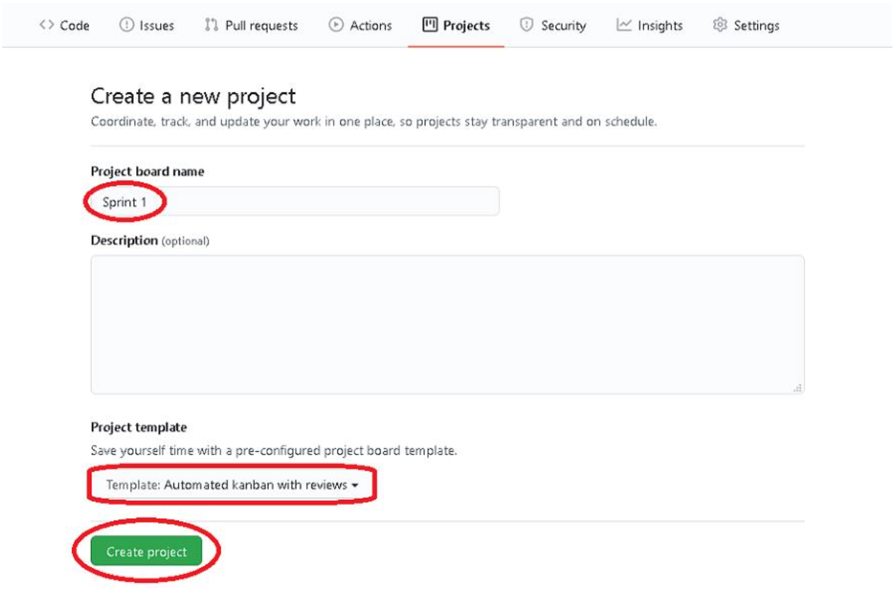

Sobald man auf "Create project" klickt wird ein automatisiertes Board erstellt.

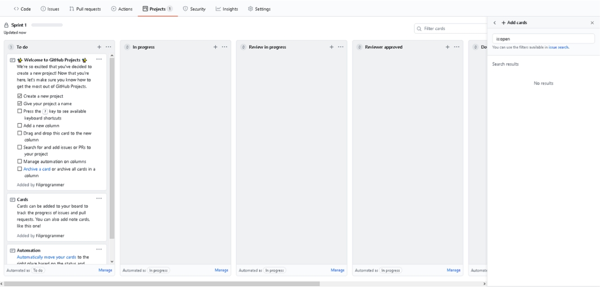

Standartmäßig sind drei Tasks in "To do". Diese sind zu löschen.

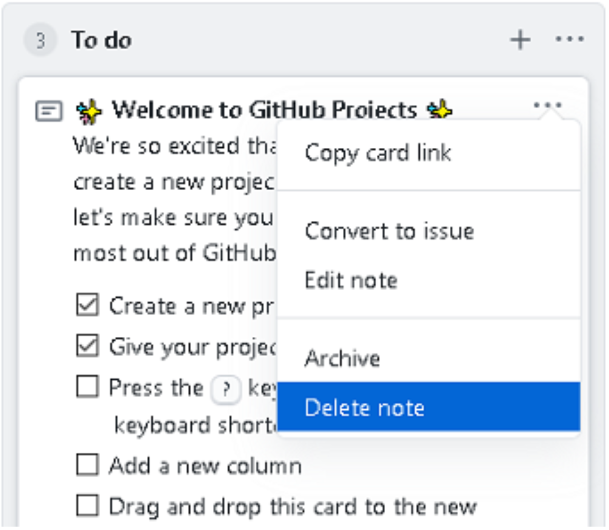

Nun sieht das "Sprint 1" Board so aus:

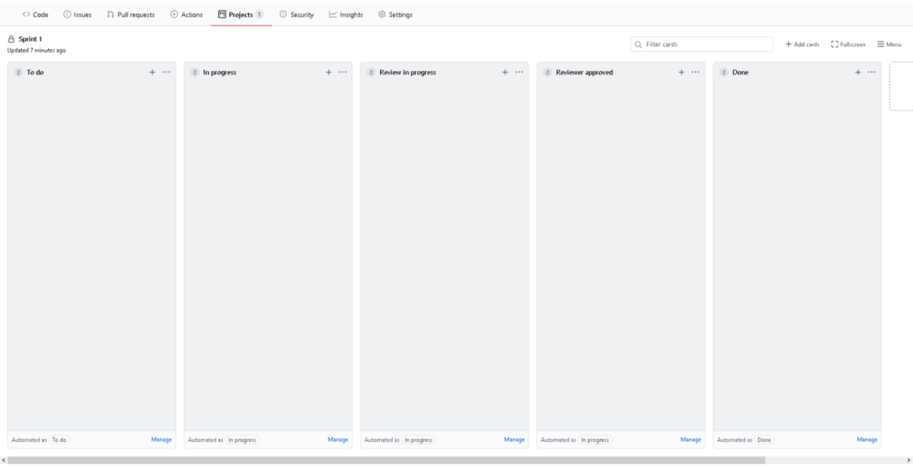

Als nächstes ist für den Sprint ein Milestone zu erstellen. (Issues --> Milestones)

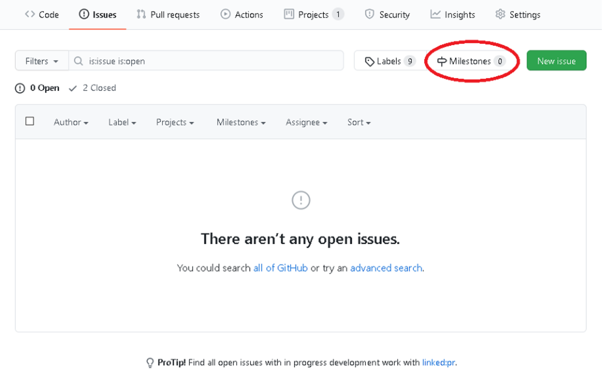

Als nächstes ist auf "New milestone" zu klicken.

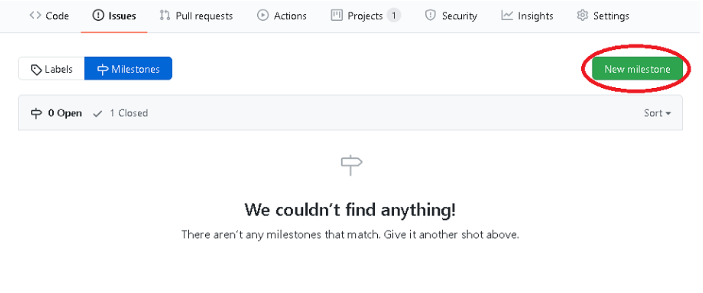

Bei einem Milestone ist es möglich dem "Sprint 1" ein Fälligkeitsdatum zu geben.

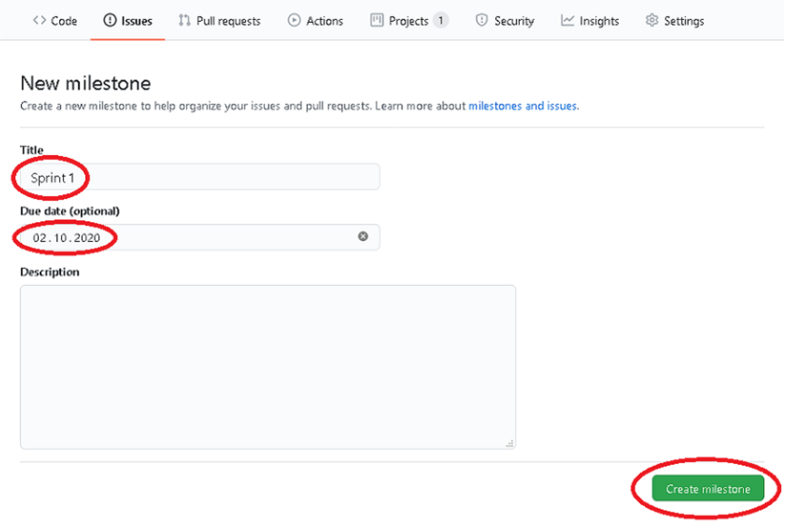

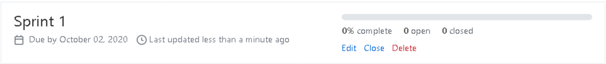

Sobald Projekt und Milestone für den Sprint aufgesetzt sind kann begonnen werden dem Sprint User Stories zuzuweisen. Hier ist ein Beispiel für ein neues Feature für Build Support für MacOS:

Um eine User Story zu erstellen (die bei GitHub "Issues" heißen), navigiert man zu "Issues" und klickt dann auf "New issue".

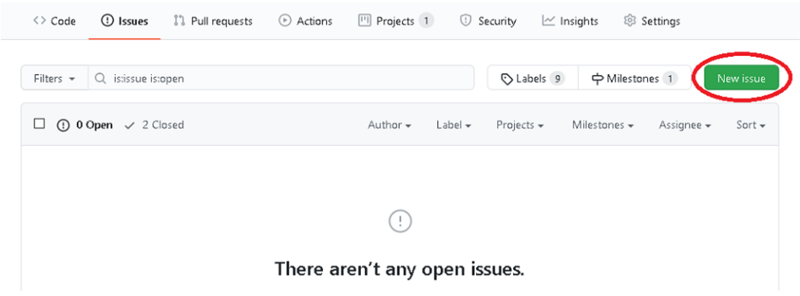

Nun kann man einen Namen für die Issue eintragen und wenn notwendig kann man noch zusätzliche Informationen darunter als Kommentar schreiben.

Demnächst soll die Issue einer oder mehreren Personen zugewiesen werden. Das geht rechts bei "Assignees".

Darunter kann man Labels zuweisen, mit denen man die Issue in gewisse Kategorien einordnen kann.

Darunter muss dem Issue das Projekt zugewiesen werden, dass in dem Fall "Sprint 1" ist.

Darunter muss der Milestone zugewiesen werden, der in dem Fall auch "Sprint 1" ist.

Letztendlich klickt man auf "Submit new issue"

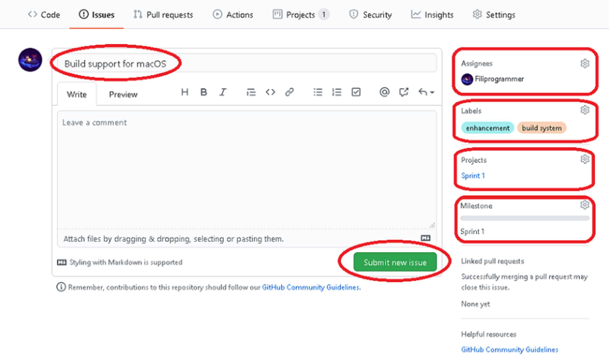

Die neue Issue erscheint automatisch in "To do" vom "Sprint 1" Board.

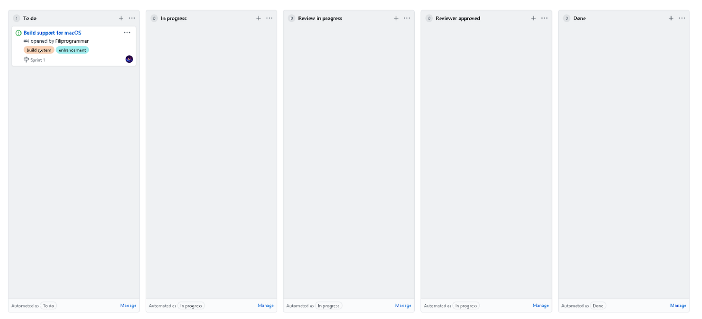

# Sprint Implementation

Wenn man während einem Sprint an einem Issue, dass einem zugewiesen wurde, beginnt zu arbeiten, zieht man es im Board von "To do" zu "In progress".

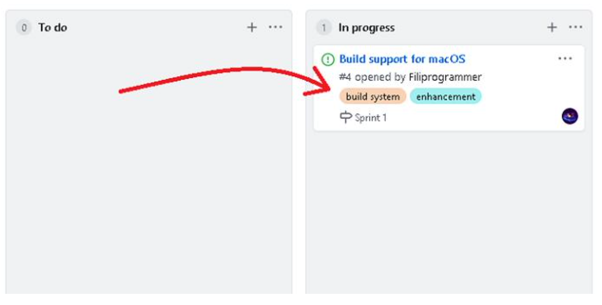

Jedes Issue hat eine Nummer. In dem Fall ist es die Nummer 4.

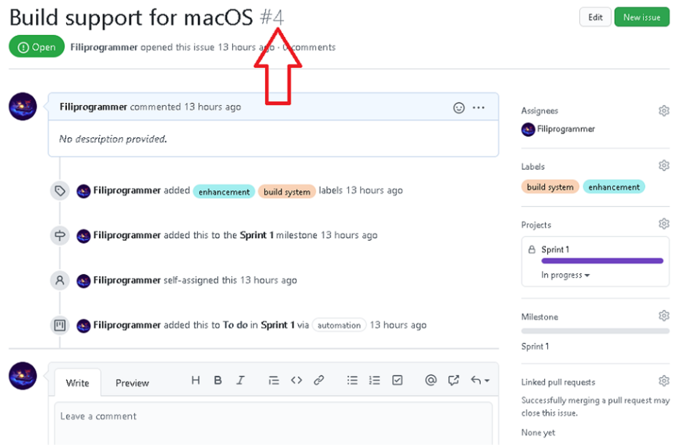

Wenn man das Repository bereits lokal geklont hat, sollte man mit folgenden drei Commands sicherstellen, dass man den neusten Stand hat:

> `git checkout main`
>
> `git fetch origin`
>
> `git reset --hard origin/main`

Mit dem Command `git checkout -b <branch-name>` kann man einen neues Branch erstellen. Für ein Issue ist auch ein eigener Branch zu erstellen auf dem man dann an der Implementierung von diesem Issue arbeitet. Das ist wichtig wenn mehrere Entwickler am selben Repository arbeiten, damit sie sich nicht gegenseitig in die Quere kommen und der master Branch stabil und sauber bleibt.

Der Branch ist auf folgende Art zu benennen:

`<Nummer der Issue>-<Kurze Beschreibung>`

Leerzeichen werden durch "-" ersetzt.

> `git checkout -b 4-macos-build-support`

Nachdem man den Branch erstellt hat, sollte dieser neue Branch auf GitHub gepusht werden. Mit folgendem Command:

> `git push -u origin 4-macos-build-support`

Nun kann man beginnen dieses Feature zu implementieren...

Es schadet nicht den Fortschritt regelmäßig auf GitHub zu backupen, durch pushen auf diesen Branch. Der Command dazu lautet: `git push`

Sobald man das Issue fertig implementiert hat, ist es Zeit ein Pull Request auf GitHub zu erstellen.

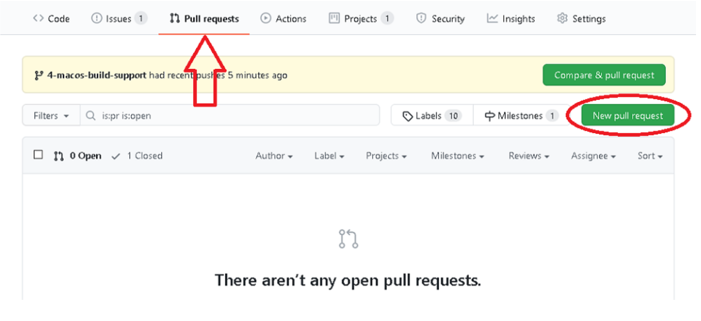

Es ist wichtig oben "base" auf "main" zu setzen und "compare" auf den Feature Branch den man erstellt hat.

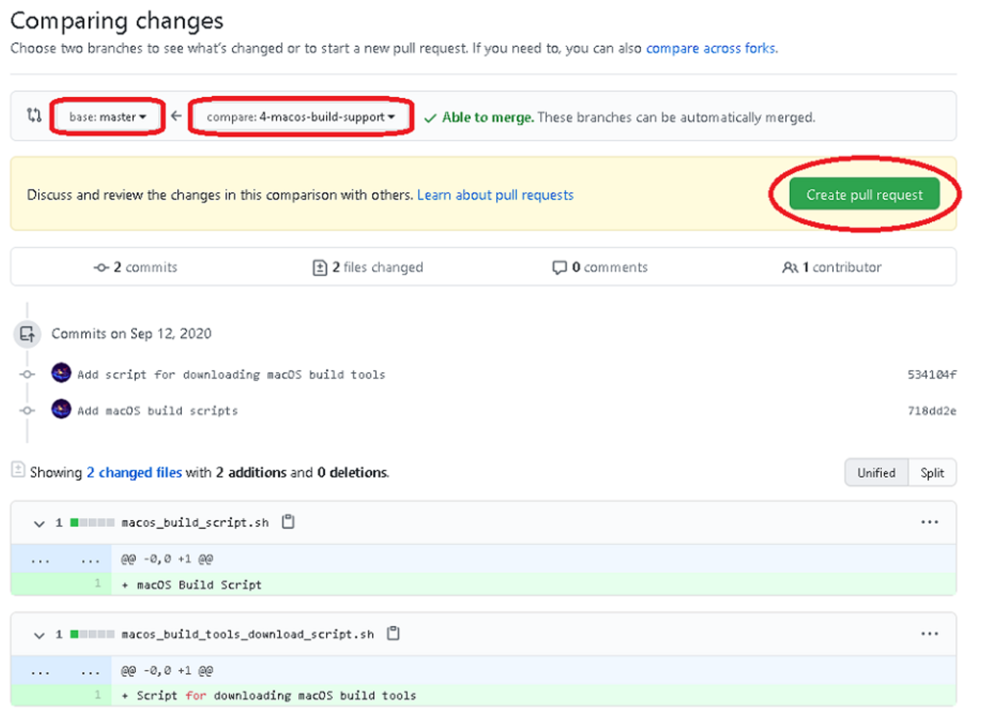

Man muss dem Pull Request einen Namen geben und als Kommentar schreibt man "closes " und dann die Nummer der Issue mit einem Hash davor, damit GitHub die Pull Request automatisch mit der Issue verlinkt.

Auf der rechten Seite können Reviewer zugewiesen werden.

Assignees, Labels, Projects und Milestones sollen mit der referenzierten Issue übereinstimmen.

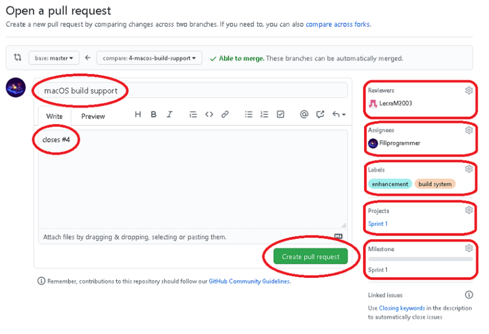

Falls es Konflikte gibt müssen diese auf dem Feature Branch gelöst werden.

# Code Review

Die Reviewer schauen sich dann den Code an, können Kommentare schreiben, Änderungen anfordern und einen Merge genehmigen. Um Code zu reviewen kann der Reviewer beim Pull Request oben auf "Files changed" klicken. Dort sind alle Änderungen zu sehen. Als Reviewer kann man nun Kommentare zu Zeilen schreiben und damit das Review starten. Sobald das passiert wird die Karte im Project Board automatisch zu "Review in progress" verschoben. Man kann auch Dateien als gesehen markieren.

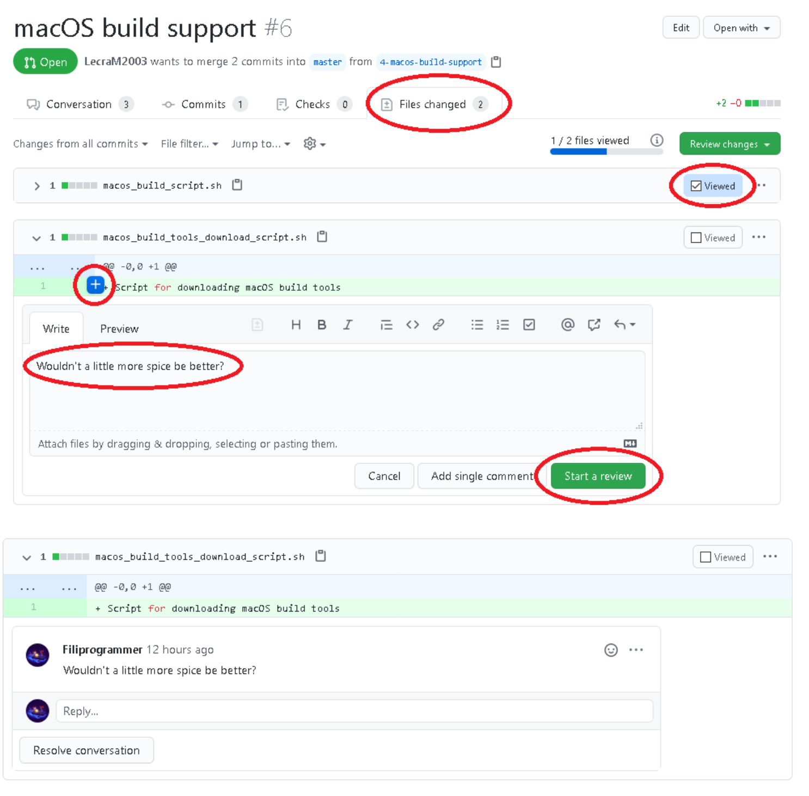

Ein Reviewer kann Änderungen beantragen.

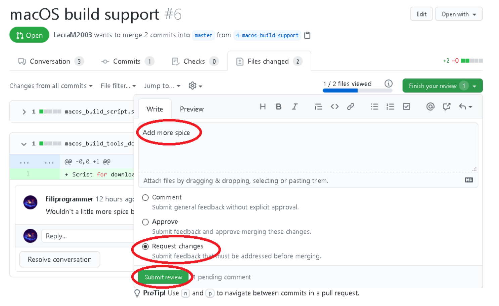

Der Entwickler kann Änderungen auf den Branch committen und pushen. Diese Änderungen werden automatisch im Pull Request angezeigt und der Reviewer kann die Änderungen genehmigen, falls er mit diesen zufrieden ist.

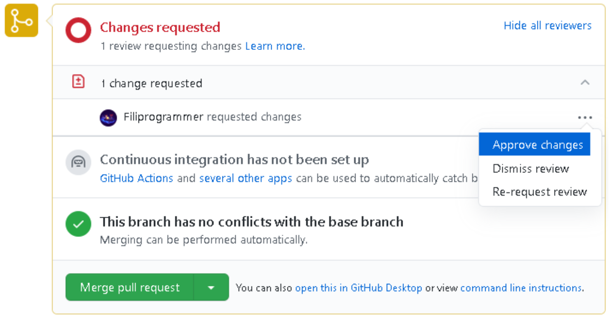

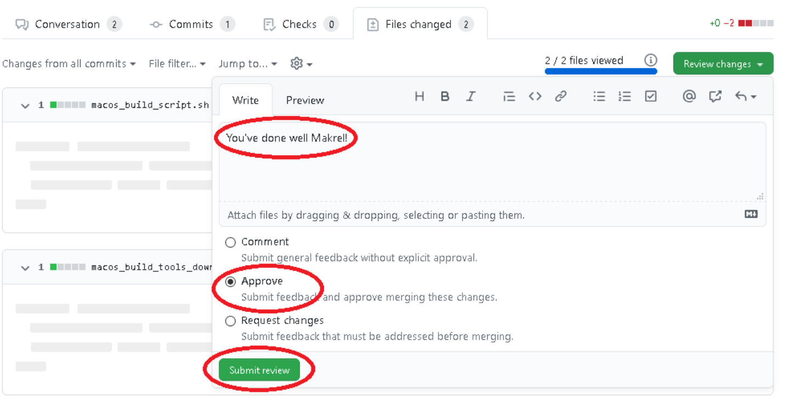

Wenn alles passt wird die Pull Request auf master gemergt. Den Branch, auf dem das Issue abgearbeitet wurde löschen wir vorerst mal nicht, um die Historie zu erhalten. Falls es Konflikte gibt müssen diese auf dem Feature Branch gelöst werden.

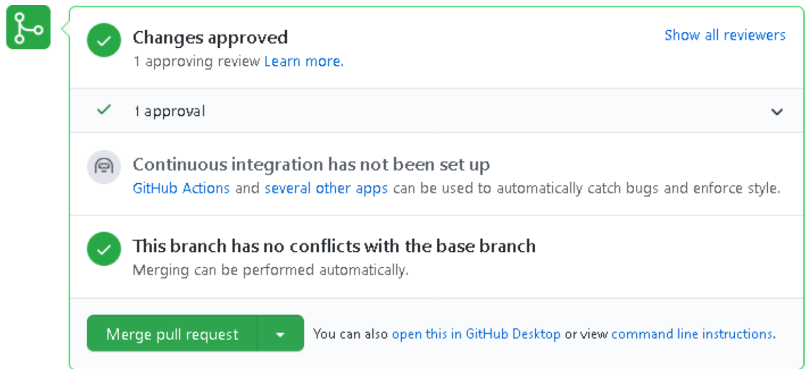

# GitHub Actions

Mit GitHub Actions kann einiges automatisiert werden. Zum Beispiel kann man den Code automatisch auf verschiedenen Systemen automatisch builden und testen lassen, sobald ein Pull Request geöffnet wird.

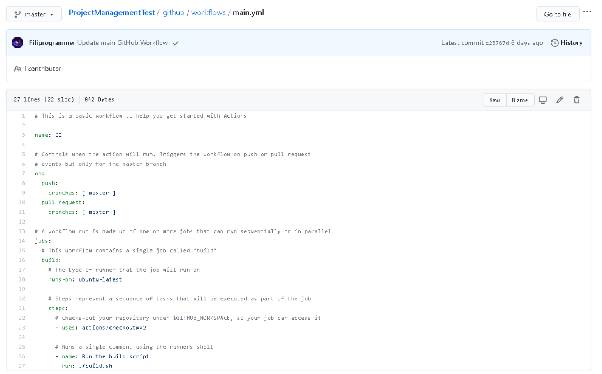
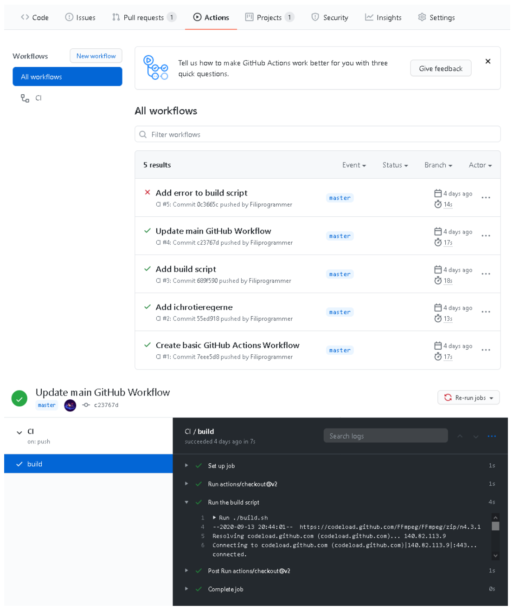

GitHub Issues Templates
https://docs.github.com/en/github/building-a-strong-community/configuring-issue-templates-for-your-repository

Labels für Issues und Pull Requests

By Filip Schauer
