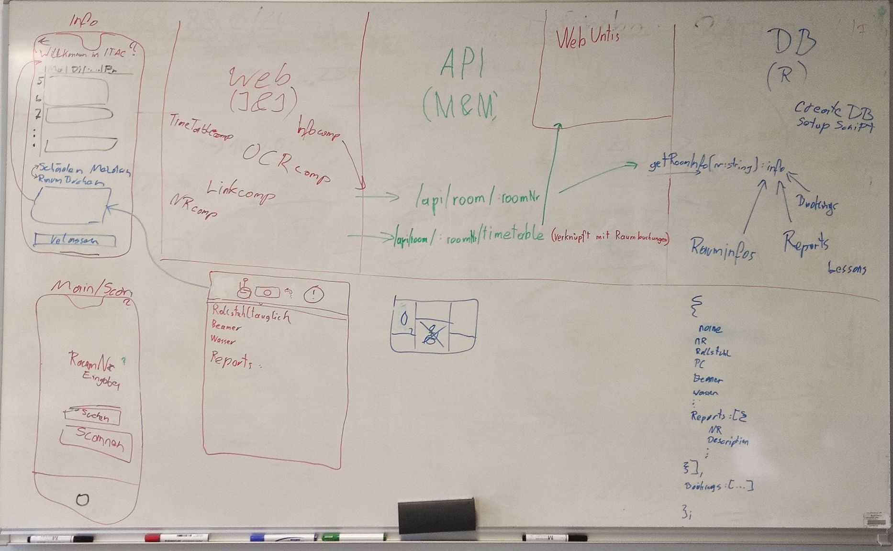

# Gesprächsprotokoll vom 15.10.2021

## Arbeitsaufteilung für die Alphaversion

- Julian und Johannes implementieren im Web Client

  - die OCR component (-> auf /ocr)
  - Link component
  - Room number input component (-> auf /)
  - Information component (-> auf /info/:roomNr)
  - Timetable component (Einfache Datenausgabe; Tabelle, nur, wenn es die Zeit zulässt) (-> auf /info/:roomNr)

- Mario und Mersed implementieren auf der API

  - den /api/room/:roomNR Endpoint
  - den /api/room/:roomNR/timetable Endpoint

- Richard implementiert eine Methode um die Rauminformationen an Mario und Mersed bereitzustellen aufgrund der Raumnummer

## Design des Web Interfaces

Beim Aufrufen der Zelia Applikation soll der Nutzer aufgefordert werden die Raumnummer einzugeben. Auf der mobilen Webseite soll der Benutzer außerdem die Möglichkeit haben die Raumnummer nach einem Tippen auf einen Button die Raumnummer einzuscannen.

Auf jeder Infoseite soll oben eine Information über die Eigenschaften des Raumes stehen. Darunter noch der Belegungsplan und die Knöpfe zum Buchen und Melden.

## Untersuchungen

- Sicherheit von der Verbindung zur MariaDB Datenbank.

- Statistik führen, welche Räume häufig abgefragt werden.

- Anhand dieser Statistik feststellen, welche Räume im Cache gehalten werden.

- Über Email authentifizieren kann zu Spam führen.

- Was soll jeder User anonym machen können? Was könnte zu Problemen führen? Wie kommt man zu den jeweiligen Informationen.

- Intellisense zur automatischen Vervollständigung der Raumsuche.

- Eigene Tabelle für Raumverantwortlichkeiten(Person in charge)
